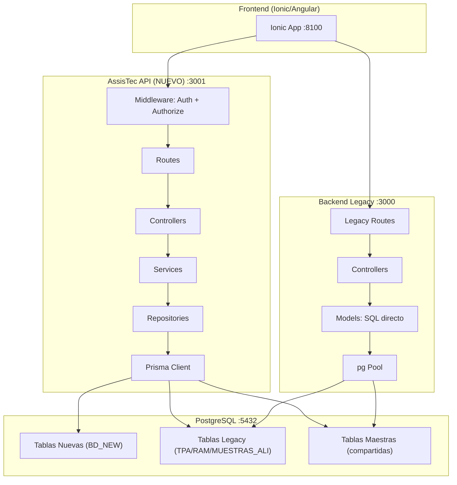
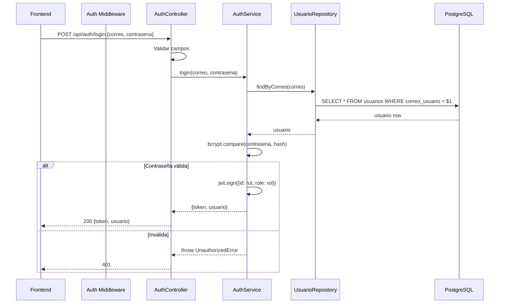
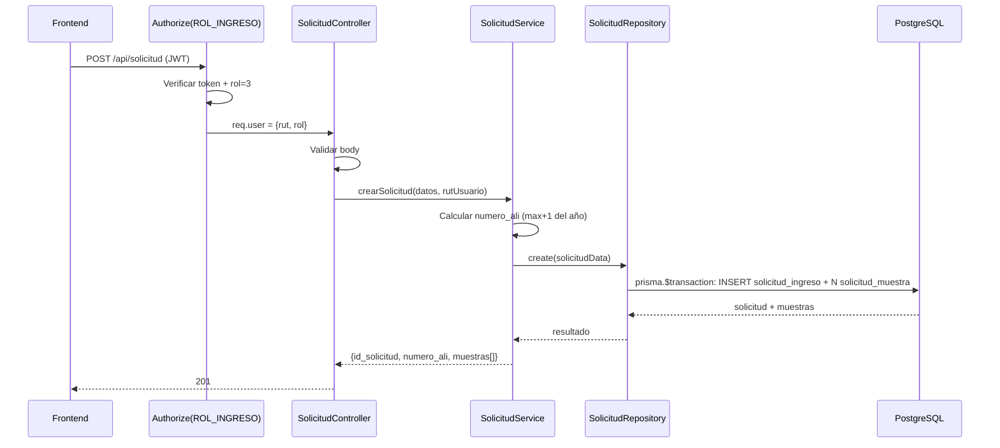
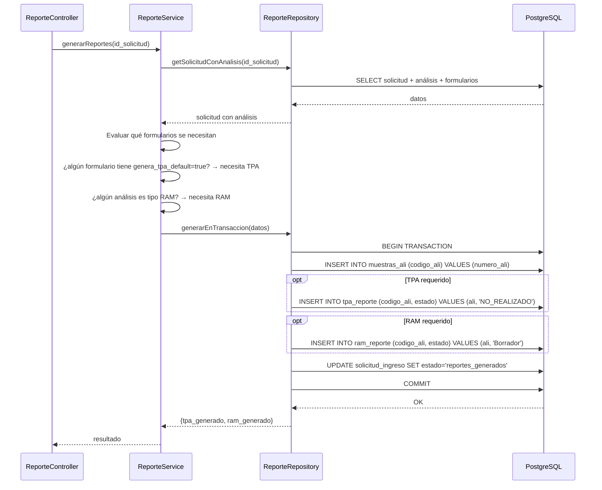
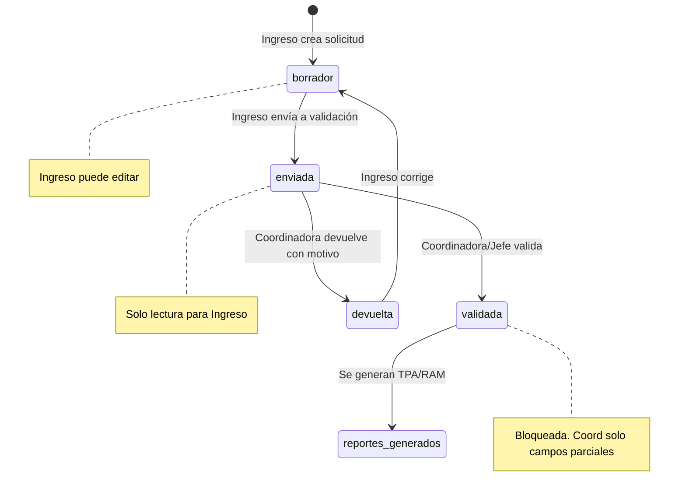

# Design: AssisTec API

## Arquitectura General



**Decisión**: Ambos backends comparten la misma BD pero acceden a tablas distintas. Las tablas maestras son compartidas. El nuevo backend accede a 3 tablas legacy via Prisma `@@map` solo para el bridge de reportes.

---

## Estructura de Directorios

```
AssisTec API/
├── prisma/
│   └── schema.prisma
├── src/
│   ├── config/
│   │   ├── prisma.js          ← Singleton PrismaClient
│   │   └── roles.js           ← Constantes ROL_ANALISTA=0, etc.
│   ├── middleware/
│   │   ├── auth.js            ← verifyToken + authorize()
│   │   └── optimisticLock.js  ← Middleware de concurrencia
│   ├── routes/
│   │   ├── auth.routes.js
│   │   ├── solicitud.routes.js
│   │   ├── muestra.routes.js
│   │   ├── analisis.routes.js
│   │   ├── reporte.routes.js
│   │   └── catalogo.routes.js
│   ├── controllers/
│   │   ├── auth.controller.js
│   │   ├── solicitud.controller.js
│   │   ├── muestra.controller.js
│   │   ├── analisis.controller.js
│   │   ├── reporte.controller.js
│   │   └── catalogo.controller.js
│   ├── services/
│   │   ├── auth.service.js
│   │   ├── solicitud.service.js
│   │   ├── muestra.service.js
│   │   ├── analisis.service.js
│   │   ├── reporte.service.js
│   │   └── catalogo.service.js
│   └── repositories/
│       ├── usuario.repository.js
│       ├── solicitud.repository.js
│       ├── muestra.repository.js
│       ├── analisis.repository.js
│       ├── reporte.repository.js
│       └── catalogo.repository.js
├── app.js
├── package.json
└── .env.example
```

---

## Flujos Clave

### Login (REQ-01)



### Crear Solicitud + Submuestras (REQ-02 + REQ-03)



**Decisión**: La solicitud y sus submuestras se crean en la MISMA transacción. El frontend envía `cantidad_muestras` y el service crea N registros en `solicitud_muestra`.

### Generación de Reportes — Bridge Legacy (REQ-05)



**Decisión**: Todo en UNA transacción Prisma. Si falla cualquier paso, rollback completo.

---

## Diseño del Optimistic Locking (NF-04)

```javascript
// Patrón en el repository
async update(id, data, expectedUpdatedAt) {
  const result = await prisma.solicitudIngreso.updateMany({
    where: {
      id_solicitud: id,
      updated_at: expectedUpdatedAt  // ← Clave del optimistic lock
    },
    data: { ...data, updated_at: new Date() }
  });

  if (result.count === 0) {
    throw new ConflictError('Registro modificado por otro usuario');
  }
  return result;
}
```

**Frontend envía**: `{ ...campos, updated_at: "2026-04-29T..." }` (el timestamp que leyó).
**Backend verifica**: Si `updated_at` en BD ≠ el enviado → 409 Conflict.

---

## Diseño de Autorización

```javascript
// src/config/roles.js
const ROLES = {
  ANALISTA: 0,
  COORDINADORA: 1,
  JEFE_AREA: 2,
  INGRESO: 3
};

// src/middleware/auth.js
const authorize = (allowedRoles) => (req, res, next) => {
  if (!req.user) return res.status(401).json({ mensaje: 'No autenticado' });
  if (!allowedRoles.includes(req.user.rol)) {
    return res.status(401).json({ mensaje: 'No tienes permiso' });
  }
  next();
};

// Uso en rutas:
router.post('/solicitud', verifyToken, authorize([ROLES.INGRESO]), controller.crear);
router.post('/solicitud/:id/validar', verifyToken, authorize([ROLES.COORDINADORA, ROLES.JEFE_AREA]), controller.validar);
```

---

## Diseño de Validación de Documentos (REQ-06)



**Regla de escritura**: El service verifica el `estado` antes de permitir UPDATE:
- `borrador` → Ingreso puede editar todo
- `enviada` → Nadie edita (en revisión)
- `validada` → Coordinadora edita campos parciales, Ingreso solo lee
- `devuelta` → Ingreso puede editar (corregir)

---

## Prisma Schema — Estrategia

### Tablas nuevas
Prisma genera las migraciones. Representación 1:1 con `BD_NEW.sql`.

### Tablas legacy (solo 3)
Se definen en el schema con `@@map` apuntando a las tablas existentes. **Sin migraciones** — Prisma NO toca estas tablas, solo las lee/escribe.

```prisma
// Ejemplo: Bridge a tabla legacy
model MuestraAli {
  codigoAli              BigInt    @id @map("codigo_ali")
  codigoOtros            String?   @map("codigo_otros")
  observacionesCliente   String?   @map("observaciones_cliente")
  observacionesGenerales String?   @map("observaciones_generales")
  fechaCreacion          DateTime  @default(now()) @map("fecha_creacion")

  tpaReporte TpaReporte?
  ramReporte RamReporte?

  @@map("muestras_ali")
}
```

**Decisión**: Se usa `prisma migrate` solo para tablas nuevas. Para las legacy se usa `@@ignore` en las migraciones o `prisma db pull` selectivo.

---

## Decisiones de Arquitectura

| # | Decisión | Rationale |
|---|----------|-----------|
| AD-01 | Express 5 + CommonJS | Consistencia con backend legacy, misma versión de Express |
| AD-02 | Prisma 6 como ORM | Elimina SQL manual, type-safety, migraciones automáticas |
| AD-03 | Mismo JWT_SECRET que legacy | Un solo token funciona en ambos backends |
| AD-04 | Repositorios encapsulan Prisma | Si se cambia ORM en el futuro, solo cambian repositories |
| AD-05 | Optimistic locking via `updated_at` | Simple, no requiere columna `version` extra, funciona con Prisma |
| AD-06 | Bridge `MUESTRAS_ALI` directo | Evita HTTP inter-service, misma BD, misma transacción |
| AD-07 | Estados como strings (no enum PG) | Más flexible para agregar estados futuros sin migración |
