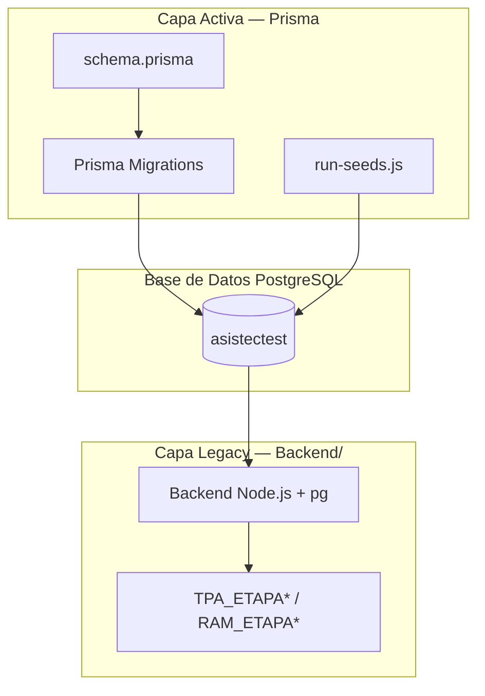

# Guía de Migraciones de Base de Datos — AssisTec

> Fuente de verdad del schema: `AssisTec API/prisma/schema.prisma`
> Gestor de migraciones: Prisma Migrate
> Motor de base de datos: PostgreSQL 16

---

## 1. Arquitectura de la Base de Datos

La base de datos de AssisTec tiene dos capas que conviven en la misma instancia de PostgreSQL:

| Capa | Fuente de verdad | Gestión | Estado |
|---|---|---|---|
| **Activa (Prisma)** | `AssisTec API/prisma/schema.prisma` | Prisma Migrate | Activa y canonical |
| **Legacy (referencia)** | `BD/init/init_refined.sql` | Raw SQL / `Backend/` legacy | Deprecada, solo referencia |

### ¿Qué gestiona cada capa?

- **Prisma (activa)**: tablas del nuevo flujo de trabajo (`clientes`, `usuarios`, `solicitud_ingreso`, `solicitud_muestra`, `solicitud_analisis`, catálogos, formularios microbiológicos `sau_*`, `coli_*`, `sal_*`, `ent_*`, etc.).
- **Legacy (`Backend/`)**: tablas de etapas `TPA_ETAPA*` y `RAM_ETAPA*` que el nuevo backend no toca. El backend legacy se conecta directamente con `pg`.
- **Bridge**: tablas compartidas (`muestras_ali`, `tpa_reporte`, `ram_reporte`) que Prisma crea y el backend legacy lee. También objetos raw SQL (`ali_imagenes`, `v_catalogo_unificado`) creados dentro de la baseline migration.



---

## 2. Workflow de Migraciones (Día a Día)

### Crear una nueva migración

1. Edita `AssisTec API/prisma/schema.prisma`.
2. Ejecuta:

```bash
make migrate
```

Esto abre `prisma migrate dev` dentro del contenedor del backend. Prisma comparará el schema actual con la base de datos, generará la migración SQL y te pedirá un nombre descriptivo.

### Aplicar migraciones existentes

Para aplicar migraciones ya commiteadas (por ejemplo, en CI o después de un `git pull`):

```bash
make migrate-deploy
```

### Antes de commitear

Revisa siempre el SQL generado por Prisma antes de commitear:

```bash
cat "AssisTec API/prisma/migrations/YYYYMMDDhhmmss_nombre_descriptivo/migration.sql"
```

Verifica que:
- Los nombres de tabla usen `snake_case` y coincidan con `@@map`.
- Las foreign keys referencien tablas que ya existen en el schema.
- No se hayan generado `DROP` inesperados.

---

## 3. Baseline Migration

### ¿Qué es la baseline?

La baseline es la migración inicial `0_baseline_20260521000000` que crea todas las tablas del schema actual de Prisma desde cero. Existe porque el schema original se sincronizó con `prisma db push`, lo que dejó el historial de migraciones sin un punto de partida válido.

La baseline:
- Tiene un timestamp anterior a la primera migración real (`20260521210000_dashboard_upgrades_roles_base`).
- Crea las 40+ tablas definidas en `schema.prisma`.
- Incluye objetos puente (`ali_imagenes`, `v_catalogo_unificado`) como raw SQL al final del archivo.
- No incluye tablas legacy `TPA_ETAPA*` ni `RAM_ETAPA*`.

### Cadena de migraciones resultante

```
0_baseline_20260521000000           ← CREATE todas las tablas + bridge objects
20260521210000_dashboard_upgrades_roles_base
20260610_saureus_phase5_calculation
20260624_enterobacterias_flow
... (migraciones subsiguientes)
```

### ¿Cómo regenerar la baseline?

No deberías necesitar regenerarla. Si el schema cambia drásticamente, crea nuevas migraciones con `prisma migrate dev`. Solo en un escenario excepcional de reescritura total del historial se regeneraría con:

```bash
# NO ejecutar sin consenso del equipo
prisma migrate diff --from-empty --to-schema-datamodel prisma/schema.prisma --script
```

---

## 4. Bootstrap desde Cero

Para levantar un entorno completamente limpio:

```bash
docker compose down -v && make dev-test
```

### Qué hace `make dev-test`

1. Detiene y elimina volúmenes existentes (`docker compose down -v`).
2. Levanta los contenedores con `LOAD_TEST_SEED=true`, pasando la variable al entrypoint del backend.
3. El `docker-entrypoint.sh` del backend ejecuta:
   - `sleep 5` para asegurar que PostgreSQL esté listo.
   - `prisma migrate deploy` — aplica baseline + 14 migraciones.
   - `node run-seeds.js` — carga catálogos, usuarios y roles de forma idempotente.
   - Si `LOAD_TEST_SEED=true`, carga `dev-test-seed.sql` con datos de prueba.
   - Inicia la API con `node app.js`.
4. `make dev-test` espera 30 segundos y muestra los últimos logs del backend.

### Capas de seed

| Capa | Archivo | Momento | Idempotente |
|---|---|---|---|
| Baseline | `migration.sql` | `migrate deploy` | `CREATE TABLE IF NOT EXISTS` |
| Base seed | `run-seeds.js` | Después de `migrate deploy` | Sí, verifica `COUNT(*) = 0` |
| Dev-test seed | `dev-test-seed.sql` | Después de `run-seeds.js` (solo si `LOAD_TEST_SEED=true`) | Sí, verifica `solicitud_ingreso` #3 |

---

## 5. Reconciliación de Bases de Datos Existentes

Si tienes una base de datos que fue creada con `prisma db push` y ya tiene las 14 migraciones aplicadas, debes marcar la baseline como ya aplicada. De lo contrario, `prisma migrate deploy` intentará crear tablas que ya existen.

```bash
make migrate-resolve-baseline
```

Esto ejecuta dentro del contenedor:

```bash
prisma migrate resolve --applied 0_baseline_20260521000000
```

La operación solo actualiza el registro de migraciones (`_prisma_migrations`). No ejecuta DDL.

### Verificar el estado

```bash
docker compose exec backend_asistec npx prisma migrate status
```

Deberías ver la baseline y las 14 migraciones como `applied`.

---

## 6. Objetos Puente (Bridge Objects)

Algunos objetos no están en `schema.prisma` pero son necesarios para la compatibilidad con el backend legacy. Se crean como raw SQL dentro de la baseline migration:

### `ali_imagenes`

Tabla auxiliar para el upload de imágenes asociadas a muestras.

```sql
CREATE TABLE IF NOT EXISTS ali_imagenes (
    id_imagen SERIAL PRIMARY KEY,
    codigo_ali BIGINT NOT NULL,
    url_imagen VARCHAR(500) NOT NULL,
    tipo_imagen VARCHAR(50) DEFAULT 'general',
    FOREIGN KEY (codigo_ali) REFERENCES muestras_ali(codigo_ali)
);
```

### `v_catalogo_unificado`

Vista que une `instrumentos` y `micropipetas` para el backend legacy.

```sql
CREATE OR REPLACE VIEW v_catalogo_unificado AS
SELECT id_instrumento AS id_origen, nombre_instrumento AS nombre,
       codigo_instrumento AS codigo, 'INSTRUMENTO' AS tipo_material,
       NULL AS capacidad
FROM instrumentos
UNION ALL
SELECT id_pipeta AS id_origen, nombre_pipeta AS nombre,
       codigo_pipeta AS codigo, 'PIPETA' AS tipo_material,
       capacidad
FROM micropipetas;
```

### ¿Cómo agregar una tabla legacy sin romper Prisma?

Si el backend legacy necesita una tabla que no está en `schema.prisma`:

1. No la agregues a `schema.prisma` a menos que el nuevo backend también la use.
2. Crea una nueva migración Prisma con `prisma migrate dev --name nombre_descriptivo`.
3. Dentro de la migración generada, añade el `CREATE TABLE` raw SQL que necesitas.
4. Nunca uses `prisma db push` para sincronizar objetos raw SQL.

---

## 7. Troubleshooting

### `make dev-test` falla en `prisma migrate deploy`

**Síntoma**: el backend no arranca y los logs muestran errores de migración.

**Causas comunes**:
1. La baseline no está presente o el timestamp es incorrecto.
2. La base de datos ya tenía tablas creadas manualmente y hay drift.
3. Una migración subsiguiente referencia una tabla que la baseline no creó.

**Solución**:

```bash
# Reset completo
make clean
make dev-test
```

O, para una BD existente:

```bash
make migrate-resolve-baseline
make migrate-deploy
```

### `run-seeds.js` no encuentra datos de catálogo

**Síntoma**: los seeds terminan pero las tablas de catálogo están vacías.

**Solución**: verifica que `prisma migrate deploy` haya corrido antes que `run-seeds.js`. El entrypoint ya lo garantiza. Si ejecutas seeds manualmente, asegúrate de que las tablas existan.

### `dev-test-seed.sql` falla con "medios_cultivos no encontrado"

**Síntoma**: el seed de prueba lanza una excepción por medios faltantes.

**Causa**: la migración `20260629_medios_cultivos` no se aplicó antes del seed.

**Solución**: ejecuta `make migrate-deploy` antes de cargar `dev-test-seed.sql`.

### Prisma Migrate detecta drift

**Síntoma**: `prisma migrate deploy` o `prisma migrate status` reportan que el schema de la base de datos difiere de las migraciones.

**Solución**: no edites migraciones aplicadas. Si el drift es en desarrollo local, usa `make migrate-reset` para recrear la base desde cero. Si es en producción, crea una nueva migración que corrija el estado.

### `relation "_prisma_migrations" does not exist`

**Síntoma**: `prisma migrate status` falla porque falta la tabla interna de Prisma.

**Solución**: la base de datos está vacía o fue creada fuera de Prisma. Ejecuta `make migrate-deploy` para inicializar el sistema de migraciones.

---

## 8. Reglas de Oro (Golden Rules)

1. **NO USAR `prisma db push` en producción ni en flujos de trabajo de desarrollo**. `db push` es solo para prototipos temporales. El proyecto usa exclusivamente `prisma migrate dev` y `prisma migrate deploy`.
2. **NO editar migraciones ya aplicadas**. Si hay un error, crea una nueva migración que lo corrija.
3. **NO borrar migraciones del historial**. Eliminar un directorio de `prisma/migrations/` rompe la cadena para otros desarrolladores y CI.
4. **SIEMPRE revisar el SQL generado** antes de commitear una migración.
5. **SIEMPRE ejecutar `make dev-test`** desde estado limpio antes de abrir un PR que toque el schema.
6. **SIEMPRE marcar la baseline como aplicada** en bases de datos existentes con `make migrate-resolve-baseline`.

---

## Referencias

- Documentación general de base de datos: `docs/database.md`
- Schema Prisma: `AssisTec API/prisma/schema.prisma`
- Baseline migration: `AssisTec API/prisma/migrations/0_baseline_20260521000000/migration.sql`
- Seeds base: `AssisTec API/run-seeds.js`
- Seed de prueba: `AssisTec API/prisma/dev-test-seed.sql`
